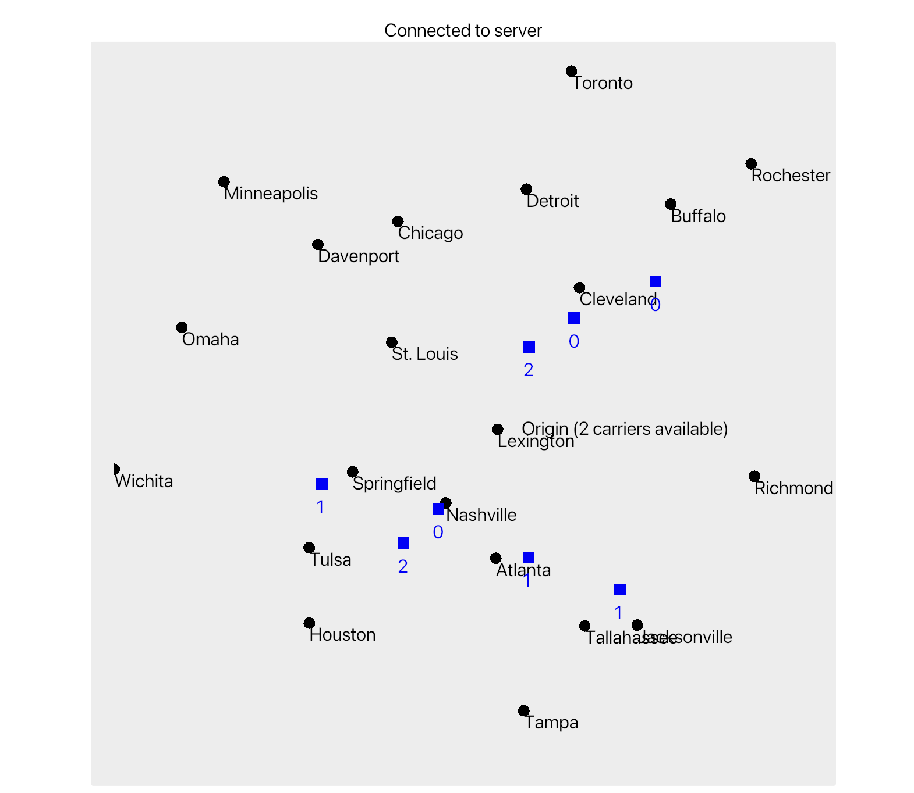

# Scheduler

A simple aerial-delivery scheduler and monitor.

_Note: this is a proof-of-concept with naive scheduling algorithm & made-up location data!_

### Contents

- Traits & types for scheduling aerial deliveries
- Example gRPC server using naive `Runner` & `Scheduler` implementations
- Example [Iced](https://github.com/iced-rs/iced) GUI client for monitoring the flights

### Usage

1. First run the server: `cargo run --bin server`
2. Then run the client: `cargo run --bin client`
